# noirr cinema

[](docs/DEVELOPMENT_PIPELINE.md)
[](docs/VALIDATION.md)
[](docs/VALIDATION.md)

The PR badges show the latest passing ready-PR gate and Rust lint result.
Coverage is the last manual full-CI measurement on `main`.

A self-hosted media server for movies, TV, anime, ebooks, audiobooks, home
videos, and photos. Cinema combines a Rust server, a browser player and admin
UI, and native Apple and Android clients. Your library stays on your hardware;
local accounts work without a cloud login. The repository and server binary
are still named `plurx` and `plurxd`.

[Features](#features) · [Screenshots](#what-it-looks-like) ·
[Quickstart](#quickstart) · [Documentation](#start-here) ·
[Development](#development)

> **Pre-1.0.** Keep backups of your media and server data. Ordinary scanning and
> playback use read-only media mounts. DVR recording and optional Dolby Vision
> on-disk conversion require explicitly configured writable storage; read the
> [operations guide](docs/OPERATIONS.md) before enabling them. Hardware playback
> and recovery support depend on the device and deployment.

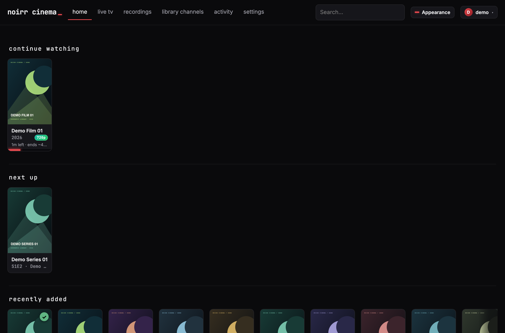

## Features

Cinema covers the library, the player, and the work of running your own server.
The [full feature inventory](docs/FEATURES.md) documents behavior, limits, and
planned work in detail.

### Build one library from many sources

- **Movies, TV, and anime.** Multiple folders per library, incremental scans,
  episode and anime absolute-number recognition, and multiple versions of a
  title. Inspect resolution, codecs, HDR, audio, subtitles, and chapters before
  pressing Play.
- **Metadata and artwork.** TMDB for movies and TV, AniList for anime, cached
  artwork, per-item refresh, and scheduled retries for missing images. A TMDB
  key is optional; local browsing and playback do not require one.
- **Books and audiobooks.** Built-in EPUB reading, reading progress,
  multipart audiobook playback, chapters, and resume. Native phone and tablet
  apps support offline EPUB copies; offline audiobooks remain planned.
- **Home videos and photos.** Browse your own folder tree, capture dates,
  local thumbnails, editable metadata, and a full-screen photo viewer.
- **Keep up with new media.** Scheduled scans, targeted import notifications,
  scoped integration keys, and a coming-soon calendar from a paired monarr.

### Watch the way your device can play

- **Direct play, remux, or transcode.** Cinema selects a delivery path for the
  client. Hardware encoding supports NVENC, Quick Sync, VA-API, and
  VideoToolbox where available, with software fallback.
- **HDR-aware delivery.** Source and delivered formats stay visible. Tone
  mapping and Dolby Vision handling follow the selected source, device, and
  delivery path; the [playback guide](docs/PLAYBACK.md) explains the limits.
- **Choose tracks before playback.** Audio and subtitle lists show language,
  codec, defaults, and forced/SDH flags. Track choices accompany the playback
  decision, including an explanation when subtitles require burn-in.
- **A player with useful controls.** Resume, chapter navigation, skip intro and
  credits, optional auto-skip, keyboard controls, fullscreen, and a stats
  overlay that explains what is actually being delivered.
- **Continue across screens.** Per-user progress, Continue watching, and
  next-episode continuation across browser, Apple, and Android clients.
  [Client coverage](docs/CLIENTS.md) records platform differences.

### Add television and channels

- **Live TV.** One configured HDHomeRun tuner, now/next information, list and
  grid guides, XMLTV support, fullscreen, and picture-in-picture where the
  client supports it. DRM-protected channels are identified and refused.
- **DVR.** Record guide airings or manual time windows, create series rules and
  reminders, follow recording activity, and play finalized recordings from
  the library. Live viewing and recording have separate enable switches.
- **Library channels.** Turn existing library titles into continuous schedules
  with personal or shared channels, now/next browsing, favorites, and
  Watch from start. Optional local Ollama matching selects titles by subject
  and explains its metadata-based decisions.

### Make it yours and keep it running

- **Layouts and themes.** Classic, Catalog, and Theater web layouts; light,
  dark, and system appearance; named themes including noirr and Terminal.
- **Local accounts.** Admin and standard users, device login tokens, and
  scoped API keys. OIDC, parental controls, and per-user library permissions
  remain planned.
- **Compatibility and history.** A bounded Plex-compatible API for supported
  clients, plus optional Trakt history and scrobbling. See the
  [feature inventory](docs/FEATURES.md) for the supported directions and limits.
- **Operations you can inspect.** Live activity, scan results, logs, readiness
  checks, Prometheus metrics, and playback diagnostics. Replicated storage,
  cluster membership, transport recovery, and media-pool tooling have
  dedicated [architecture and qualification records](docs/README.md).
- **One server application.** Run on Linux, macOS, or Windows x64, with
  Docker/Compose and native deployment recipes. No external database service
  is required.

## What it looks like

These captures use generated artwork, sample media, and fictional demo entries.
No personal library titles, posters, or filenames appear. TV guide and recording
status examples use synthetic fixtures. The [screenshot tour](docs/features/SCREENSHOT-TOUR.md)
shows the full set of native, Live TV, DVR, and library layouts.

### Native apps on phones and tablets

The same library has native iPhone, iPad, and Android views. Browse, resume,
open the guide, and find recordings from the client’s own navigation.

| iPhone | Android |
|---|---|
| 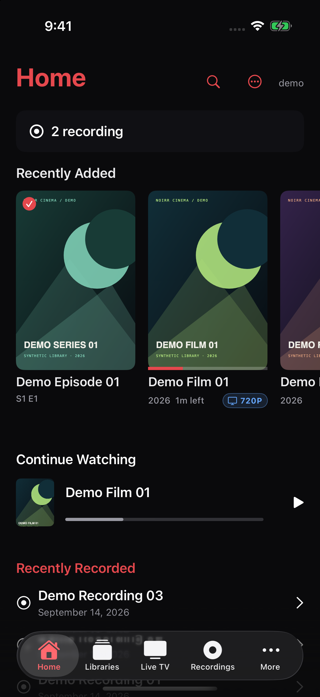 | 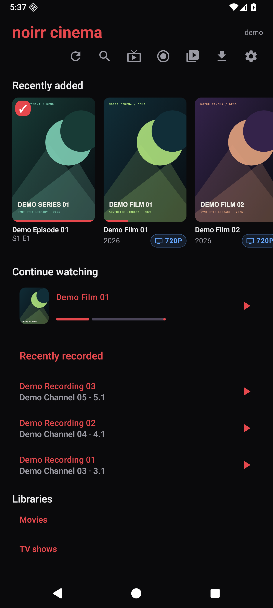 |

Tablet layouts, native TV guides, and recording views are in the
[screenshot tour](docs/features/SCREENSHOT-TOUR.md).

### Live television and DVR

Browse airings in a list or grid, preview a channel, and see which programmes
are recording. The preview below plays generated sample video.

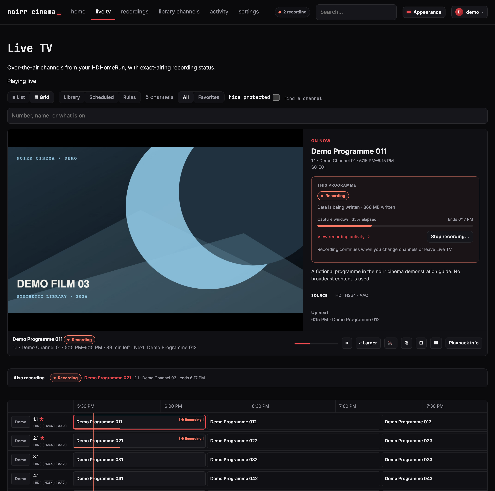

<details>
<summary>Recording activity and saved programmes</summary>

**Activity** shows active recordings and their capture details together.

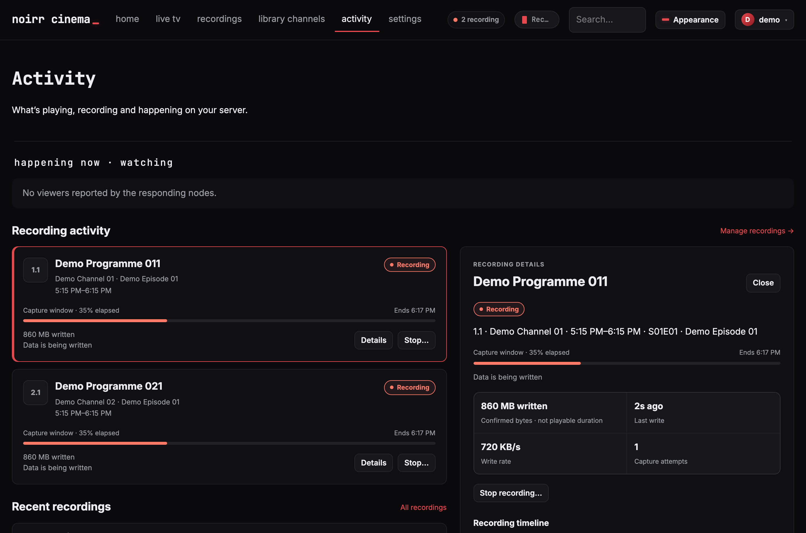

**Saved** collects completed recordings for playback.

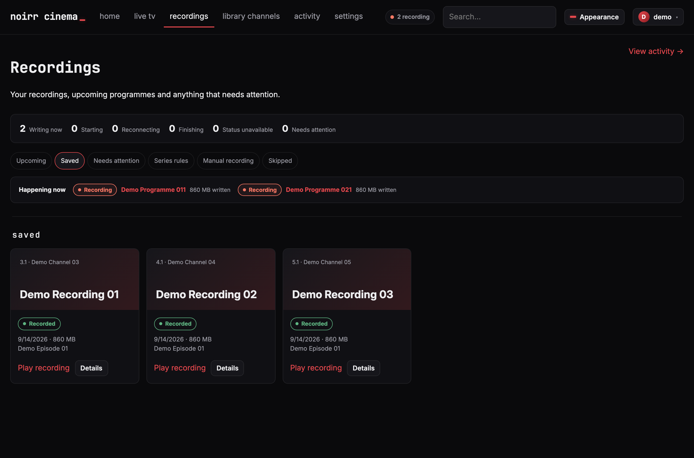

</details>

### Inspect a title before you play

The item page brings together artwork, playback actions, and file and track
facts.

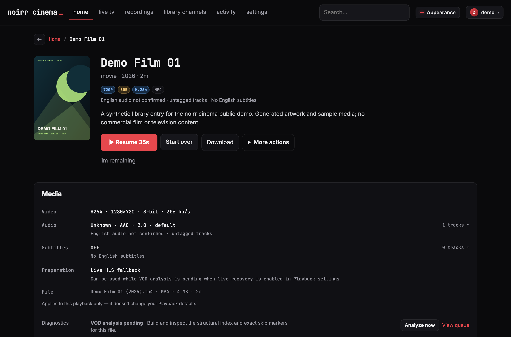

### See what the player is doing

The stats overlay explains the source and delivery path while the player keeps
its controls over the picture.

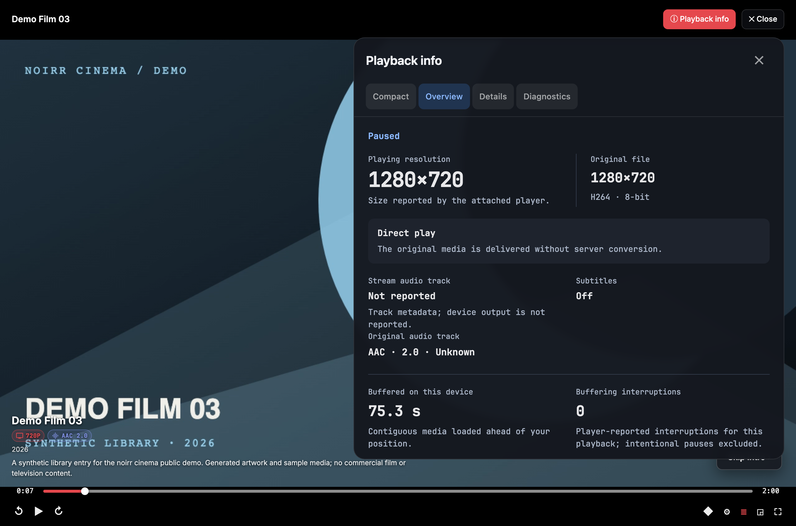

<details>
<summary>More screenshots: Skip Intro, Settings, and Terminal</summary>

**Skip Intro** appears during a marked intro region. Auto-skip is optional.

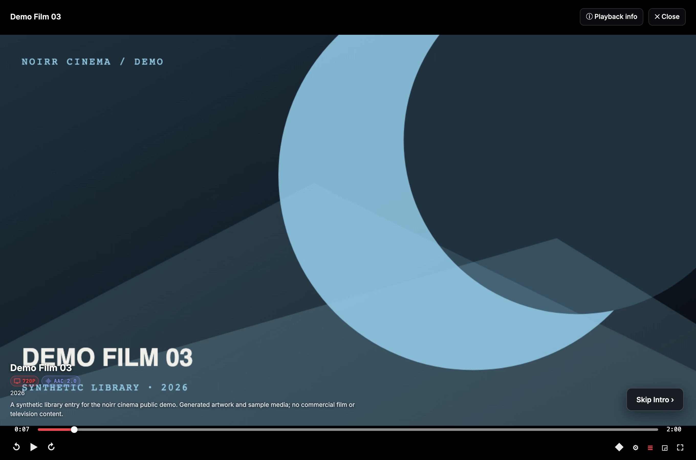

**Settings** groups server, library, playback, and maintenance controls by task.

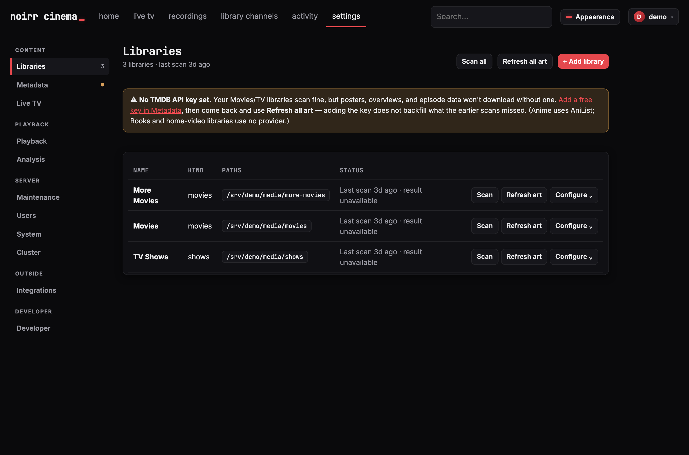

**Terminal** gives the same library a monospace theme with green accents.

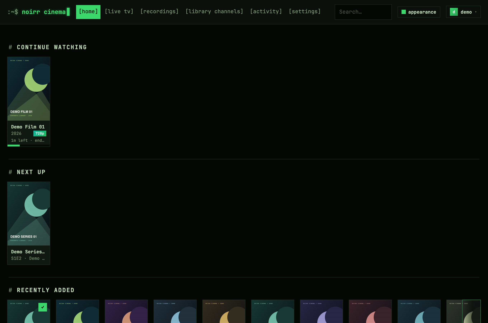

</details>

## Quickstart

Docker/Compose is the recommended homelab setup. Start from a checkout of this
repository; install Docker with Compose first.

```bash
# Run from the repository root: writes deploy/.env and the override file from
# their examples, creates /srv/plurx, builds the server, starts it with the
# source commit stamped into the image, and waits for it to answer.
make install-docker

# Then put your media mounts and optional GPU access in the override file and
# redeploy — that is the command from now on.
$EDITOR deploy/docker-compose.override.yml
make docker-up
```

1. Open `http://<server>:32400` and create the first administrator account.
2. Go to **Settings → Libraries → Add & scan**. Choose a library kind and the
   path visible **inside the container**.
3. Optionally add your TMDB key in **Settings → Metadata** for movie and TV
   metadata and posters.
4. Open a title and press **Play**. Open **Stats** or press `i` to inspect the
   delivery path.

A library that scans zero files usually has an incorrect container path or
unreadable mount. The [scan-status guide](docs/OPERATIONS.md#reading-library-scan-status)
explains the counts and errors. Keep the server data directory persistent:
it holds accounts, keys, library metadata, and watch state.

## Install

All server variants serve the web app and API on port `32400` by default.

| Deployment | Start here | Requirements |
|---|---|---|
| Docker / Compose | `make install-docker`, then `make docker-up` | Docker with Compose; configured media and data mounts |
| Native service (systemd, launchd, or the Windows service) | `make install` | Repository-pinned Rust toolchain, or a prebuilt `plurxd` via `INSTALL_FLAGS=--binary` |
| Native binary, no service | `make install-binary`, then `plurxd run` | `ffmpeg` and `ffprobe` (installed for you when missing) |
| Build from source | `cargo run -p plurxd` | Repository-pinned Rust toolchain; `ffmpeg` and `ffprobe` |

Hardware transcoding also needs the appropriate GPU driver and device access.
Configuration layers defaults, `plurx.toml`, and `PLURX_*` environment variables;
accounts, libraries, provider keys, and runtime preferences are managed in
Settings.

The [deployment guide](deploy/README.md) covers Compose, native services,
Windows, systemd, launchd, Unraid, storage, GPU access, and ports. The
[client guide](docs/CLIENTS.md) covers native apps and Plex-compatible clients.

## Start here

| I want to… | Read |
|---|---|
| See the full feature set and its limits | [Features](docs/FEATURES.md) |
| Run and troubleshoot the server | [Operations](docs/OPERATIONS.md) |
| Find commands quickly | [Cheat sheet](docs/CHEATSHEET.md) |
| Understand playback decisions | [Playback](docs/PLAYBACK.md) |
| Understand the architecture | [Architecture](docs/ARCHITECTURE.md) |
| Connect an application | [API](docs/API.md) · [Integrations](docs/INTEGRATION.md) |
| Understand authentication and exposure | [Security](docs/SECURITY.md) |
| Contribute and validate a change | [Development pipeline](docs/DEVELOPMENT_PIPELINE.md) · [Validation](docs/VALIDATION.md) |
| Find plans, delivery status, or test evidence | [Documentation index](docs/README.md) |
| Follow releases and changes | [Releasing](docs/RELEASING.md) · [Changelog](CHANGELOG.md) |

The [documentation index](docs/README.md) is the complete map of maintained
references and subject-specific plans. Each entry states its question and
status.

## Development

Use `rustup` so [rust-toolchain.toml](rust-toolchain.toml) selects the exact
compiler, Clippy, and rustfmt versions. Validation tooling needs Python 3.11+;
media tests also need `ffmpeg` and `ffprobe` on `PATH`.

```bash
make run                # build and serve on http://localhost:32400
make hooks              # install the repository's commit checks
make check              # history, operations, catalog, benchmark, and Rust baseline
make validate-staged    # validate the functionality points affected by staged files
make                    # list all available targets
```

The web app is [embedded in the binary](crates/plurxd/src/web/index.html), so
UI edits require a rebuild and restart. Follow the
[development pipeline](docs/DEVELOPMENT_PIPELINE.md) for branch, review, and
qualification rules. If your checkout has no compiler, use the
[source-only compile loop](docs/ci/AGENT-COMPILE-LOOP.md) before pushing.

## Layout

| Path | Purpose |
|---|---|
| [crates/plurx-core](crates/plurx-core) | Domain model, storage, scanner, metadata, and playback decisions |
| [crates/plurxd](crates/plurxd) | HTTP server, playback orchestration, and embedded web UI |
| [crates/plurx-compat-plex](crates/plurx-compat-plex) | Plex API compatibility and discovery |
| [clients](clients) | Native Apple and Android applications |
| [tests](tests) | Operations, browser, playback, and integration contracts |
| [deploy](deploy) | Container and native deployment recipes |
| [docs](docs/README.md) | Reference documentation, plans, and qualification records |

## Status

Cinema is pre-1.0 and under active development. The feature overview describes
implemented behavior; device support, rollout evidence, and remaining work are
tracked in the [feature inventory](docs/FEATURES.md),
[client guide](docs/CLIENTS.md), and [delivery records](docs/README.md).
The [roadmap](docs/ROADMAP.md) preserves the project phases and design history.

## Non-goals

- **No cloud account requirement or streaming-service aggregation.** Cinema
  serves your library and configured tuner; metadata and integrations are
  optional network services.
- **No automatic organization of your media.** Ordinary library maintenance
  does not rename or move source files. Writable conversion and DVR storage
  are explicit operator choices.
- **No general music library.** Audiobooks belong in Books; personal video and
  photos belong in Home libraries.
- **No DRM bypass.** Protected television channels cannot be played or recorded.

## License

plurx is licensed under the Apache License 2.0 — see [LICENSE](LICENSE).

Apache-2.0 grants commercial use, modification, and redistribution, and
carries an express patent grant from every contributor, with a retaliation
clause that terminates it for anyone who sues over patents. It withholds
trademark rights: the plurx and cinemarr names and marks are not licensed
with the code.

Contributions are accepted under Apache-2.0 §5 — submitting a change licenses
it under the same terms, with no separate agreement to sign.

Bundled fonts and libraries, the four vendored crates, and the one
redistribution obligation that comes with the container image are documented
in [THIRD-PARTY-NOTICES.md](THIRD-PARTY-NOTICES.md). Nothing plurx ships is
copyleft: ffmpeg is invoked as a subprocess and never linked, and the one
copyleft dependency anywhere in the tree (JUnit, EPL-1.0) is test-scoped and
reaches no artifact. `make license-check` enforces the allow-list in
[deny.toml](deny.toml).
