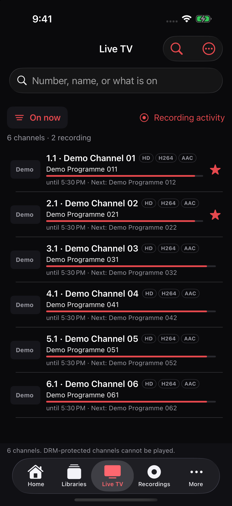
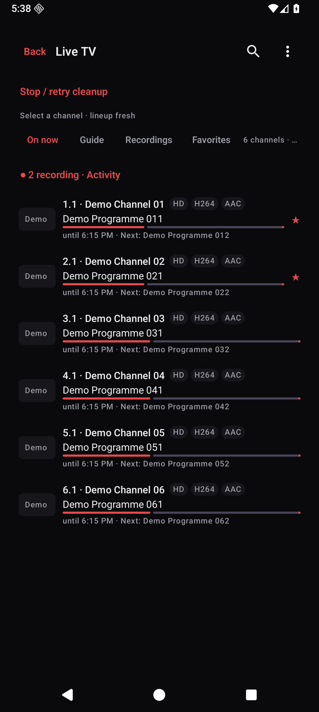
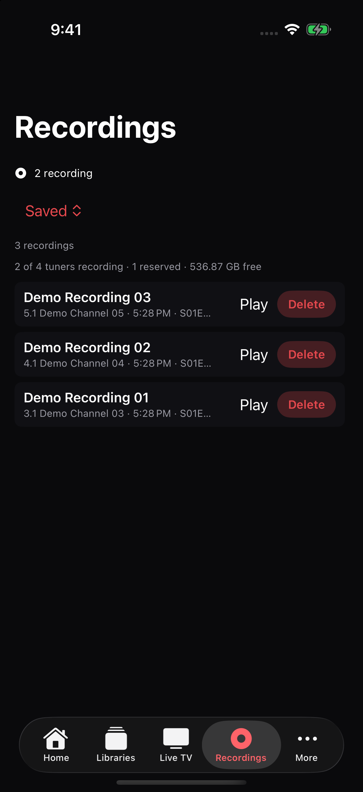
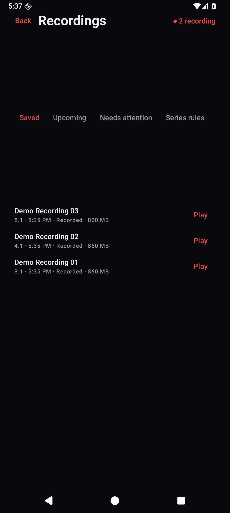
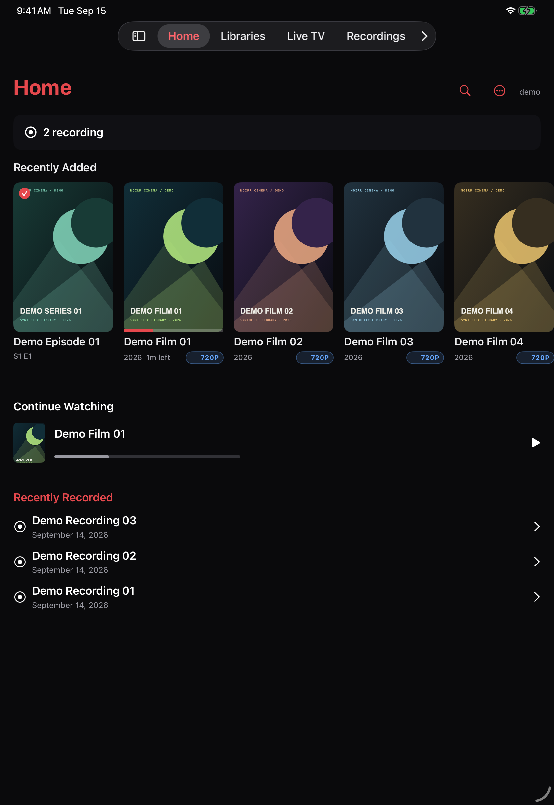
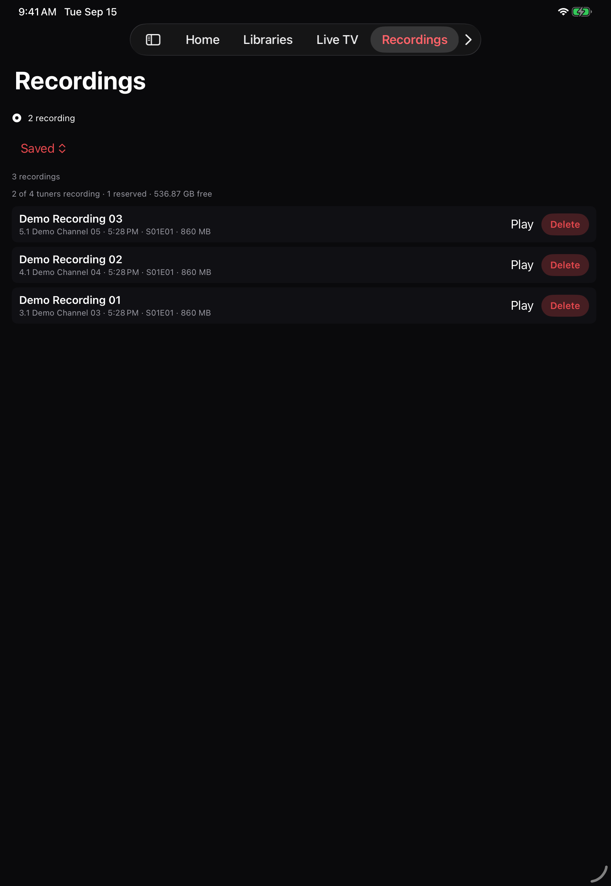
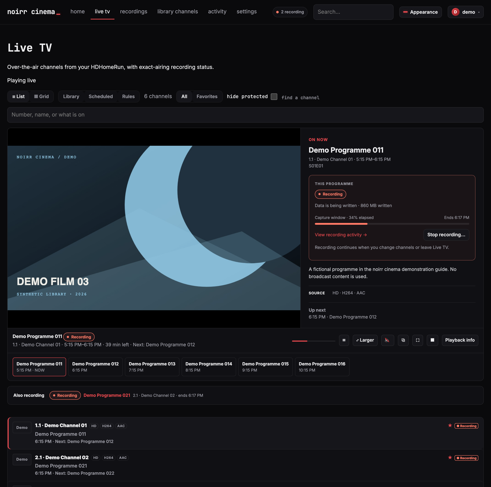
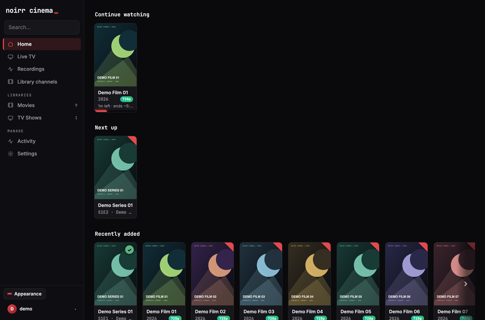
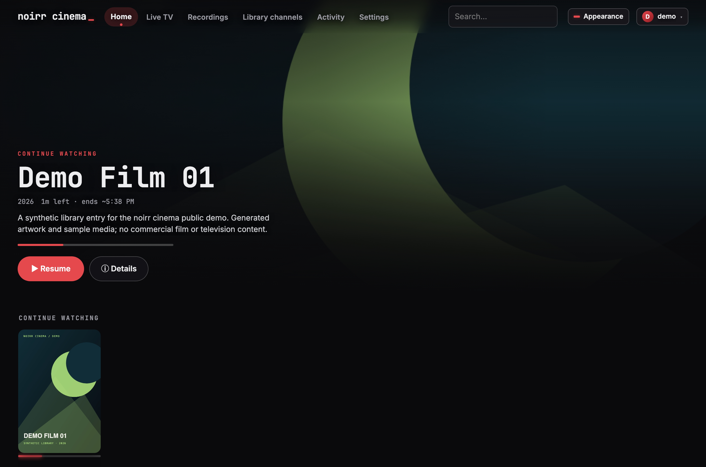

# Screenshot tour — Cinema across screens and features

**Status:** live · **Captured:** 2026-09-15

Companion to the [README](../../README.md) and [feature inventory](../FEATURES.md).
This page shows how the same library, television guide, and recordings appear
in the browser and native apps. [Client coverage](../CLIENTS.md) describes
platform differences.

All titles, programme names, artwork, media, channels, and recordings below are
synthetic demo content. The TV guide and recording status use fixture API
responses; these are interface captures, not evidence of a household tuner or
a completed hardware recording test.

## Native phones — browse, watch, and find recordings

The iOS and Android apps have their own native navigation and controls.
These captures show iPhone 17 Pro and Pixel 10 Pro XL emulator layouts.

### Home

| iPhone | Android phone |
|---|---|
|  |  |

### Live TV

Now/next information, favorites, and recording activity stay beside the channel
list. The guide uses fictional channels and programme names.

| iPhone | Android phone |
|---|---|
|  |  |

### Recordings

Browse saved programmes, check upcoming recordings, and move into recording
activity. The sample saved entries point to generated demo media.

| iPhone | Android phone |
|---|---|
|  |  |

## iPad — native navigation with more room

The iPad Pro 11-inch capture shows the wider Home shelves and the native tab
bar. The recording view keeps its filters, tuner summary, and saved entries
together.

| Home | Saved recordings |
|---|---|
|  |  |

## Browser television — list and grid guides

The list emphasizes what is on now. The grid places airings on a timeline;
recording badges identify the specific programme being captured. The preview
plays generated sample video through the Live TV player.

### List guide

### Grid guide

## DVR — follow a capture and browse saved programmes

Activity combines recording cards with capture details: confirmed bytes, last
write, transfer rate, and the event timeline. Saved recordings have their own
browsing page. The values in these examples come from a synthetic fixture.

## Browser library layouts — Catalog and Theater

The README opens with Classic. Catalog and Theater arrange the same library
in different ways; themes and appearance are separate choices.

### Catalog

### Theater

## Capture provenance

The application source is from `main` at `39625f9fe105`. The native iOS and
Android apps were rebuilt before capture. Disposable native launch helpers
selected existing screens and connected to the demo server; they are not part
of the shipped apps. Browser branding and the Android wordmark were set to
“noirr cinema” for these captures. Screen structure and rendering come from the
application views, not image mockups.

The existing screenshot filenames and dimensions remain unchanged. Additional
native images use the simulators' pixel dimensions; additional desktop images
use a 1360-pixel-wide browser viewport at 2× scale.
